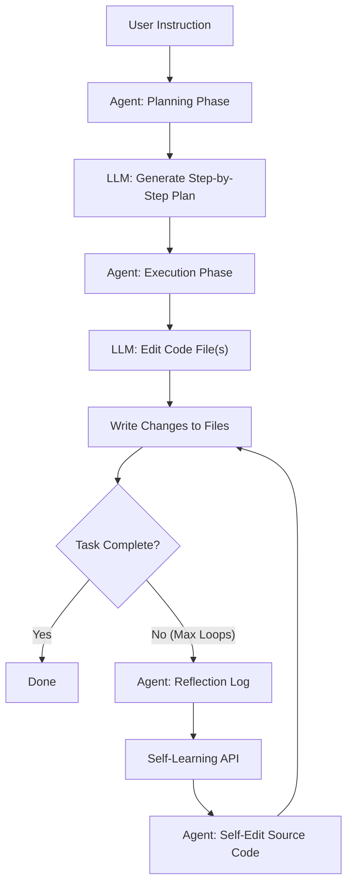
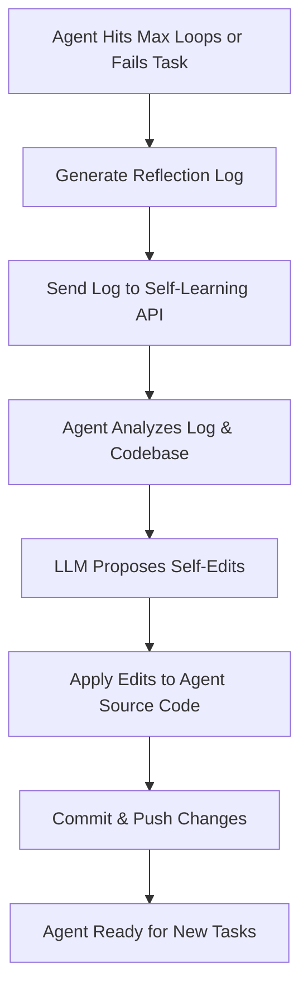

# mini: The Self-Evolving Coding Agent

**mini** is an experimental, autonomous coding agent that not only edits and refactors codebases using large language models (LLMs), but also learns from its own actions and can self-edit its own source code to "evolve" over time.

## What is mini?

mini is designed to be a minimal, maintainable, and extensible Python agent that:
- **Autonomously edits code** based on high-level user instructions using LLMs (e.g., OpenAI GPT-4).
- **Self-learns** by reflecting on its own failures and generating logs of its reasoning process.
- **Self-edits** its own source code, using LLM-driven analysis of reflection logs and code diffs, to improve and evolve its capabilities.
- **Closes the feedback loop** by automatically applying, committing, and pushing its own code changes.
- **Remains lightweight and easy to integrate** into existing workflows.

## Key Features

- **LLM-powered code editing:** Refactor, improve, or transform codebases with natural language instructions.
- **Self-reflection:** Generates detailed logs when tasks fail or reach complexity limits, capturing its own reasoning and process.
- **Self-editing and evolution:** Analyzes its own logs and code, proposes and applies improvements to its own source code, and version-controls these changes.
- **API for self-learning:** Includes a Flask-based API endpoint for receiving reflection logs and triggering self-improvement cycles.
- **Minimal and extensible:** Clean, lean codebase designed for easy extension and integration.

## Installation

Clone the repository:

```bash
git clone https://github.com/stancsz/mini.git
cd mini
```

(If dependencies are required, add them to a `requirements.txt` and install with `pip install -r requirements.txt`.)

## Prompt Flow Overview



- The agent receives a user instruction and plans the steps with the LLM.
- It executes the plan, asking the LLM to edit code.
- If the task is not completed after several loops, it generates a reflection log.
- The reflection log is sent to the self-learning API, which can trigger the agent to self-edit its own codebase, closing the feedback loop.

## Self-Evolving Mechanism



- When the agent cannot complete a task, it generates a reflection log.
- The log is sent to the self-learning API endpoint.
- The agent uses the LLM to analyze the log and its own codebase, proposing and applying self-improvements.
- Changes are committed and pushed to version control.
- The improved agent is ready to handle new tasks, enabling continuous self-evolution.

## Usage

See `example.py` for a basic usage example.

```python
from coding_agent.agent import Agent

agent = Agent()
# Use the agent as needed
```

Or run the agent to refactor a project:

```python
from coding_agent import run_coding_agent

run_coding_agent(
    prompt="Refactor all functions to use async/await.",
    code_dir="./my_project",
    pr_title="Refactor to async/await",
    pr_body="This PR refactors all functions to use async/await syntax.",
    pr_branch="refactor-async-await",
    commit_and_push=True
)
```

You may need to configure environment variables. See `.env.example` for reference.

## Self-Learning API

Start the self-learning API server:

```bash
python self_learning_api.py
```

The agent will POST reflection logs and self-edit diffs to the `/self-learning` endpoint, which will apply, commit, and push code changes.

## Playwright MCP Setup

This project supports browser automation and web testing via the [Playwright MCP](https://github.com/microsoft/playwright-mcp) server.

### Requirements

- Node.js 18 or newer

### Configuration

The Playwright MCP server is already configured in `.vscode/settings.json`:

```json
{
  "mcpServers": {
    "playwright": {
      "command": "npx",
      "args": [
        "@playwright/mcp@latest"
      ]
    }
  }
}
```

If you use VS Code, Cursor, Windsurf, or Claude Desktop, this configuration will automatically launch the Playwright MCP server for you.

### Usage

Once the server is running, the agent can access Playwright MCP tools for browser automation and testing.

To verify your setup, run:

```bash
pytest tests/test_playwright_mcp.py
```

This will run a test that uses Playwright MCP to automate a browser and check the result.

-------

## Testing

Run the tests using:

```bash
python -m unittest discover tests
```

### Dummy Project for Testing

A folder named `tests/dummy project/` is included in this repository. This dummy project is used exclusively for testing purposes. Unit tests may reference this folder, and it should not be considered part of the main application logic.

## Project Structure

```
coding_agent/
    __init__.py
    agent.py
    mcp.py
    utils.py
example.py
self_learning_api.py
tests/
    test_agent.py
.env.example
```

## Contributing

Contributions are welcome! Please open issues or submit pull requests for improvements or bug fixes.

## License

[MIT License](LICENSE)
