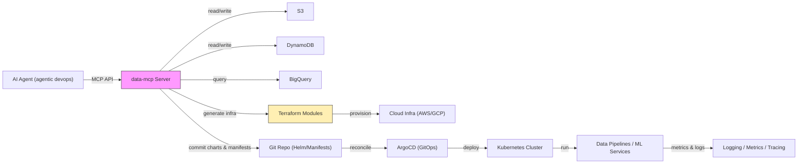
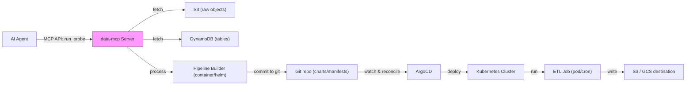
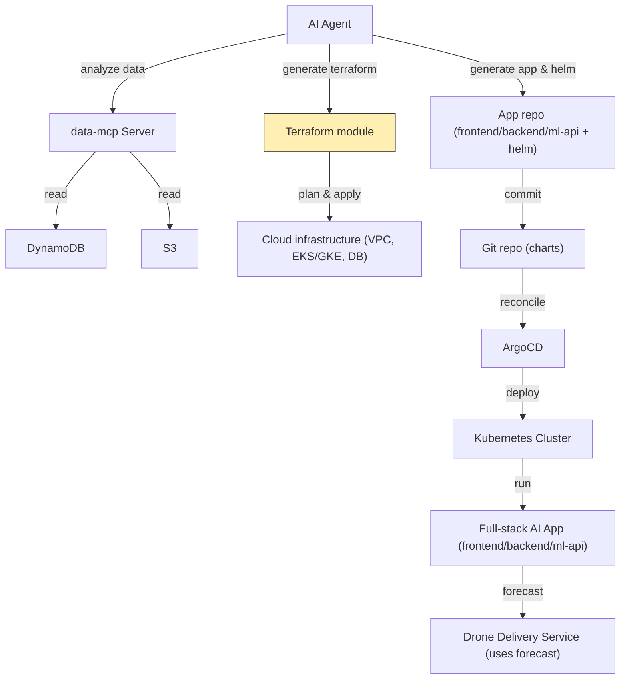

# data-mcp

data-mcp is an MCP (Model Context Protocol) server built with the fastmcp framework (https://github.com/jlowin/fastmcp). It provides a secure, enterprise-ready bridge that allows AI agents to interact with major data platforms on AWS and GCP. The server exposes data access and data-pipeline capabilities to agents while enforcing service-account based authentication and policy-driven authorization (RBAC / ABAC).

Sales pitch — why this matters for platform engineering:
- Platform teams are expected to deliver secure, repeatable, and fast developer experiences while reducing time-to-production. data-mcp provides an AI-first control plane that lets agentic systems design, provision, and operate data infrastructure and applications with policy-driven safety and auditability.
- By combining data access (S3/Dynamo/BigQuery), infrastructure-as-code (Terraform), and GitOps (ArgoCD), data-mcp reduces the friction between data discovery, pipeline development, and production deployment — accelerating platform engineering velocity while preserving governance and observability.
- This capability is increasingly critical as organizations adopt agentic workflows and expect platforms to enable safe, automated composition of data apps, ML services, and infra changes without manual orchestration overhead.

High-level architecture (mermaid)


Key goals:
- Securely expose AWS and GCP data sources to agentic systems via MCP.
- Use service-account based authentication to enable role/attribute-based access control.
- Provide built-in agentic capabilities: probe caching (Redis), multi-source data retrieval, transformation and onward delivery.
- Support common enterprise data systems: S3, Redshift, DynamoDB, GCS, BigQuery.

Table of contents
- Features
- Architecture overview
- Supported connectors
- Security & access control (Service Accounts, RBAC / ABAC)
- Agentic capabilities (Redis caching, probe data, pipelines)
- Quick start
- Configuration examples
- Usage patterns & examples
- Development notes
- Contributing
- License

## Features
- FastMCP-based MCP server for delivering data access functionality to AI agents.
- Connectors for:
  - AWS: S3, Redshift, DynamoDB
  - GCP: GCS, BigQuery
- Service Account control:
  - Agents authenticate using service account credentials (SA).
  - The MCP server relays SA credentials when authorized, enabling secure, role-based and attribute-based access.
  - Enterprise-grade control model for least-privilege access.
- Agentic abilities:
  - Redis-backed caching for probe results, reducing repeated expensive fetches.
  - Ability to probe multiple sources, merge/transform results, and write to a specified target.
  - Pluggable pipeline stages: fetch -> process -> transform -> deliver.
- Audit-friendly: logs and access patterns designed for auditability in enterprise environments.

## Architecture overview
1. Agent (client) connects to the MCP server via the fastmcp protocol.
2. Agent authenticates using a service account credential (SA token/JSON/key).
3. MCP validates the SA against local policies and maps it to allowed roles/attributes.
4. Agent requests data access or pipeline execution.
5. MCP:
   - Optionally checks Redis cache for recent probe results.
   - If needed, pulls data from up to two (or more) configured sources (e.g., S3 + BigQuery).
   - Runs processing/transform steps (user-defined or built-in).
   - Writes/transfers the result to a requested destination (S3/GCS/etc.) if authorized.
6. MCP returns structured results and stores audit logs.

A high-level diagram (textual):
Agent -> fastmcp -> data-mcp server
data-mcp server -> [Auth/Policy Engine] -> [Redis cache] -> [Connectors: S3, Redshift, DynamoDB, GCS, BigQuery] -> [Processing/Transforms] -> [Destination]

## Supported connectors
- AWS
  - S3: object storage access
  - Redshift: data warehouse queries & exports
  - DynamoDB: key/value and document data access
- GCP
  - GCS: object storage access
  - BigQuery: analytics queries & exports

Connectors are implemented as modular adapters so adding other data systems should be straightforward.

## Security & Access Control
- Service Accounts (SA) are the primary authentication mechanism.
  - Agents present SA credentials to the MCP server.
  - MCP validates and, if authorized, uses or relays SA credentials to access cloud resources on behalf of the agent.
- Role-Based Access Control (RBAC)
  - Map SAs to roles that define allowed data operations and resources.
- Attribute-Based Access Control (ABAC)
  - Policies may consider attributes like environment, project, agent id, time-of-day, and resource tags.
- Principle of least privilege
  - The MCP server aims to only allow resource access consistent with the SA’s effective permissions and local policy.
- Auditing & logging
  - All access requests, relayed credential usage, and pipeline operations should be logged for compliance.

## Agentic capabilities
- Redis caching:
  - Probe results can be cached in Redis to reduce duplicate expensive reads.
  - Cache keys are derived from probe parameters (sources, query, credentials scope).
- Multi-source probes:
  - The server can fetch from two different sources, merge or stitch datasets, then process them (join, aggregate, filter).
- Processing & Transforms:
  - Built-in transforms (filter, aggregation, format change) and a plugin hook for custom processors.
- Delivery:
  - After processing, results can be sent to a target destination chosen by the agent (S3, GCS, or other sinks) given authorization.

Example flow:
1. Agent requests a combined probe: S3 (parquet) + BigQuery (query) for a specified time range.
2. MCP checks Redis for cached result.
3. If not cached, MCP pulls data from both sources, runs a processing pipeline (sample normalization + aggregation), stores the output to a destination (GCS), and caches the probe result.
4. MCP returns a response referencing the destination location and metadata.

## Quick start (overview)
Prerequisites:
- Python 3.8+ (or the language/runtime used by this project)
- Access to AWS and/or GCP with appropriate service account credentials.
- Redis instance for caching (optional but recommended).
- fastmcp installed (this project is built on top of fastmcp).

Basic steps:
1. Clone this repo:
   git clone https://github.com/stancsz/data-mcp-server.git
2. Configure credentials (see next section).
3. Configure service accounts, policies, and connector settings.
4. Start the MCP server (example):
   - The exact command depends on the project layout (e.g., `python -m data_mcp.server` or `uvicorn data_mcp.app:app --reload`). Check the `./bin` or `./scripts` folder or the project’s main module.
5. Connect an agent using fastmcp protocol and authenticate with an SA credential.

Note: This README provides the conceptual setup. See the configuration examples below and the repo's config files for concrete examples.

## Configuration examples

Environment variables (common):
- AWS:
  - AWS_ACCESS_KEY_ID
  - AWS_SECRET_ACCESS_KEY
  - AWS_SESSION_TOKEN (optional)
  - AWS_REGION
- GCP:
  - GOOGLE_APPLICATION_CREDENTIALS=/path/to/service-account.json
- Redis:
  - REDIS_URL=redis://:password@host:6379/0
- MCP:
  - MCP_PORT=your_port
  - MCP_HOST=0.0.0.0

Sample config (YAML) - connectors and policies (example snippet):
```yaml
connectors:
  s3:
    enabled: true
    default_bucket: my-tenant-bucket
  bigquery:
    enabled: true
    project: my-gcp-project
  redshift:
    enabled: true
  dynamodb:
    enabled: true
  gcs:
    enabled: true

auth:
  service_accounts:
    - id: sa-data-analyst
      allowed_roles: [read-only]
      attributes:
        department: analytics

cache:
  redis_url: redis://localhost:6379/0
  ttl_seconds: 3600

pipeline:
  default_processors:
    - normalize
    - deduplicate
    - aggregate
```

Service account onboarding:
- Upload or register SA credential(s) with the MCP server (secure secret store).
- Assign roles and attribute mappings to the SA.
- Define per-SA or per-role policies controlling:
  - which connectors may be used
  - which buckets/tables/datasets are accessible
  - whether delivery to external sinks is allowed

## Usage patterns & examples
- Data probe:
  - Agent requests a probe; MCP returns either cached result or initiates a fetch & process.
- Cross-source join:
  - Pull data from S3 (daily files) and BigQuery (reference table), join in-memory, and write output to GCS.
- Export pipeline:
  - Agent triggers a pipeline that extracts data from Redshift, transforms it, and writes CSVs to S3 for downstream systems.

Example (pseudocode) request payload
```json
{
  "action": "run_probe",
  "auth": {
    "service_account": "base64-or-path-or-token"
  },
  "sources": [
    { "type": "s3", "bucket": "tenant-bucket", "path": "2025/09/15/*.parquet", "format": "parquet" },
    { "type": "bigquery", "project": "my-project", "query": "SELECT * FROM dataset.table WHERE date = '2025-09-15'" }
  ],
  "processors": [
    { "name": "filter", "params": { "column": "status", "value": "active" } },
    { "name": "aggregate", "params": { "group_by": ["country"], "metrics": ["sum(amount)"] } }
  ],
  "destination": { "type": "gcs", "bucket": "results-bucket", "path": "agent-outputs/2025-09-15/" }
}
```

## Development notes
- Connector adapters are modular. To add a new connector:
  - Implement a connector class with the standard fetch/query/write interface.
  - Register the connector in the server's connector registry.
- Processor hooks:
  - Processors are stateless functions that accept input data, parameters, and return transformed data.
- Caching:
  - Cache keys should consider source signature, query text, credentials identity, processors list, and any relevant parameters.
- Auditing:
  - All actions must include metadata (agent id, SA id, timestamp, target resources) and be logged to a secure append-only store (or exported to your SIEM).

## Testing & CI
- Unit tests should mock cloud connectors and Redis.
- Integration tests can be run against localstack (for AWS) and the BigQuery emulator (or a test GCP project).
- CI should validate policy enforcement scenarios (RBAC/ABAC) to ensure no privilege escalation paths.

## Contributing
- Fork the repo and submit PRs for bug fixes, new connectors, or processor modules.
- Ensure tests accompany new features.
- Follow semantic commit messages and include CHANGELOG entries for user-facing changes.

## Security considerations
- Do not store SA credentials in source control.
- Use a secure secrets manager for stored credentials (e.g., AWS Secrets Manager, GCP Secret Manager, Vault).
- Ensure encrypted transit (TLS) for all MCP and connector communications.
- Apply the least privilege principle for any transient credentials issued or relayed by the MCP server.

## Roadmap / future ideas
- Add fine-grained data masking and field-level access control.
- Introduce connectors for additional cloud and on-prem data warehouses.
- Add an audit UI for compliance teams to review agent activity and data flows.
- Implement policy templates for common enterprise compliance regimes (SOC2, HIPAA, GDPR).
- Integrate with ArgoCD for GitOps deployments of Kubernetes manifests and Helm charts.
  - The MCP server will be able to author, update, and push Helm charts and Kubernetes manifests to a Git repository watched by ArgoCD.
  - ArgoCD will continuously reconcile the Git repo to the target Kubernetes cluster, enabling automated deployment of data pipelines and services.
- Provide Terraform automation hooks for provisioning cloud infrastructure (AWS/GCP) programmatically.
  - Agents can generate Terraform plans/modules that the MCP server can apply (via a controlled runner) or commit to a repo for CI/CD.
  - The server will include opinionated Terraform templates for common infra (VPCs, EKS/GKE clusters, IAM roles, S3/Dynamo/GCS, managed databases).
- End-to-end deployment capability:
  - The MCP server is capable of provisioning required infra, building and packaging pipeline components (containers/Helm charts), and deploying them to Kubernetes using ArgoCD.
  - The MCP server can install the necessary resources (service accounts, RBAC bindings, ArgoCD app manifests, Terraform state backends) to enable seamless agent-driven deployments.
- Roadmap priorities:
  1. Harden ArgoCD integration: secure Git credentials, app lifecycle management, audit trails for deployments.
  2. Terraform runner & safe apply: interactive approvals, plan inspection, and policy gates.
  3. Templates & blueprints: ready-made pipeline, ML-serving, and full-stack app blueprints.
  4. Observability: bundle logging, metrics, and tracing for deployed pipelines and infra changes.
  5. Compliance: policy-as-code integration (e.g., OPA/Gatekeeper) to prevent insecure deployments.

## Endgame / Project Purpose
This project's long-term goal is to enable AI agents to rapidly design, provision, and ship production-grade data applications. The "data-mcp" server is intended to be the control-plane that allows an agent to:
- Discover and pull data from sources (S3, DynamoDB, BigQuery, etc.).
- Assemble data pipelines (transformations, joins, ML features).
- Provision infrastructure as code (Terraform) and deploy applications/pipelines to Kubernetes (Helm / ArgoCD).
- Manage lifecycle and audits for deployments, ensuring least-privilege operations and traceability.

## Agent Examples & Diagrams
Below are example workflows and Mermaid diagrams showing how an AI agent can use this MCP server to build and deploy data apps.

Example 1 — Data pipeline creation + Kubernetes deployment (ArgoCD)
- Agent pulls raw data from DynamoDB and S3.
- Agent generates a pipeline (container + Helm chart) that performs ETL and writes back results.
- Agent commits the Helm chart and manifests to a Git repo watched by ArgoCD.
- ArgoCD deploys the Helm chart to the target cluster and keeps it reconciled.



Example 2 — Full-stack AI app prototype with Terraform + ML forecast
- Agent inspects a table (e.g., orders) in DynamoDB or a dataset in S3 to estimate data needs.
- Agent generates Terraform to provision infra: EKS/GKE cluster, managed DB, object storage, IAM roles.
- Agent generates application code scaffolding (frontend + backend + ML API) and Terraform/Terragrunt to deploy.
- Agent builds ML model (demand forecast) and exposes it via an API in the deployed stack.
- The MCP server can apply Terraform (with appropriate approvals) and push the application manifests to ArgoCD for deployment.



Notes:
- These examples are illustrative. Actual implementations should include security checks, policy gates, and manual approval steps where appropriate (especially for Terraform apply).
- The repository will include templates/blueprints for common pipelines and full-stack prototypes to accelerate agent workflows.

## Contact & support
- Repo: https://github.com/stancsz/data-mcp-server
- Issues: please open GitHub issues for bugs or feature requests.
- For enterprise integrations, include contact details or internal support channels here.

---
This README is intended to be a guiding blueprint. Update the repository's configuration, examples, and run instructions to match the actual code layout and run scripts used in this project.
